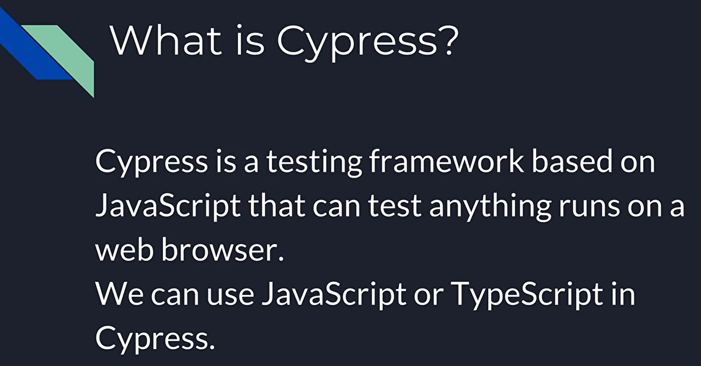
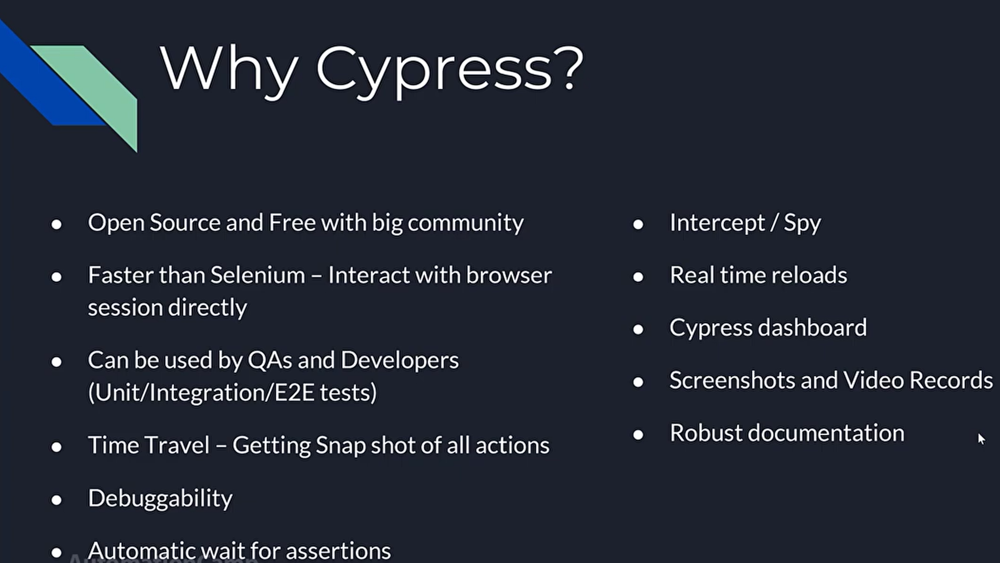
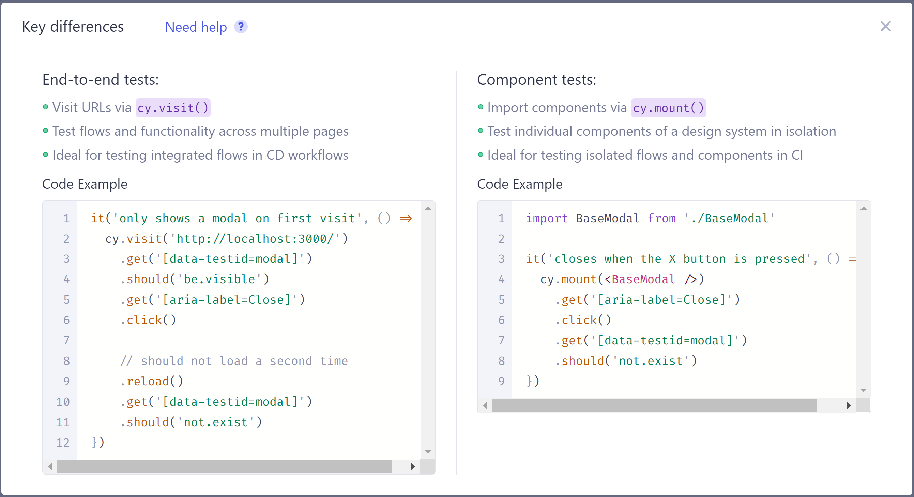
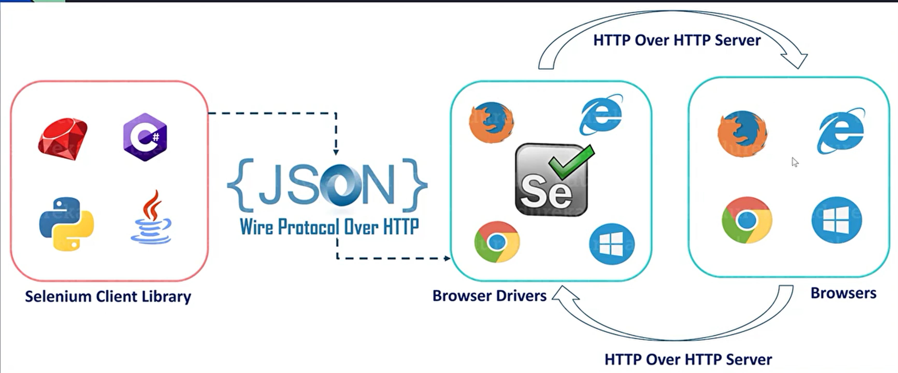
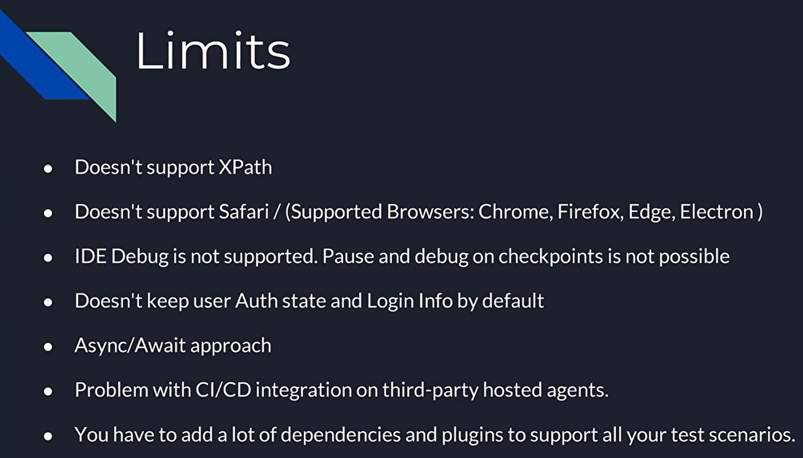

معرفی Cypress
===

سایپرس یک ابزار نسل جدید مبتنی بر جاوااسکریپت است که برای Front End Testing ویژه سیستم‌های مدرن وب تولید شده است. در واقع برای تست هرآنچه درون مرورگر اجرا می شود. این ابزار که قابلیت اسکریپت نویسی را برای Test Developerها، فراهم کرده است، در چهار حوزه اسکریپت‌نویسی به این افراد کمک می‌کند:

* ستاپ کردن و تنظیم کردن شرایط اجرای تست
* نوشتن تست‌ها
* اجرا کردن تست‌ها
* دیباگ کردن تست‌ها

## چراCypress

* اپن سورس - free و دارای community وسیع
* به دلیل ارتباط مستقیم با browser از سلنیوم (یکی دیگر از ابزارهای تست معروف) سریع تر است
* چون بر پایه جاوااسکریپت است هم برای QA تسترها برای انجام تست E2E و هم برای developer ها برای انجام component test، unit test و integration test مناسب است.

* داشتن ویژگی time travel و تهیه snapshot از همه ی اکشن ها

اما Cypress اغلب اوقات با سلنیوم مقایسه می شود. با این حال Cypress به صورت پایه‌ای و از لحاظ معماری با سلنیوم متفاوت است. باید بگوییم این ابزار محدودیت‌های Selenium را شامل نمی‌شود. همین موضوع باعث می‌شود شما بتوانید سریعتر، راحت تر و قابل اعتمادتر تست بنویسید. هر چند که نمی‌توان مزایای فوق العاده سلنیوم را نیز نادیده گرفت.

## با چه هدفی از Cypress استفاده می‌کنند؟
سایپرس می‌تواند هر آنچه را که در یک مرورگر اجرا می‌شود، و به نوعی Front End سیستم محسوب می‌شود را تحت تست قرار دهد.
سایپرس یکی از بهترین گزینه‌های پیش روی ما در شرایطیست که:
* می‌خواهید تست‌ها را روی مرورگرهای Firefox یا مبتنی بر Chrome(مانند Google Chrome، Chromium-based Microsoft Edge، و Electron) اجرا کنید.
* و دارای یک دانش ابتدایی روی Java Script هستید.
* و بخواهید درگیر تست‌هایی در سطوح Integration یا Unit شوید و یا قصد اجرای تست‌های End-to-End را داشته باشید، آنچنانکه رفتار و خروجی عملیات تست در حیطه مرورگر انجام شود

## محدودیت ها

## امکانات Cypress
در اینجا لیستی از کارهایی که Cypress قادر به انجام آن است و بخشی از امتیازات آن محسوب می‌شود ارائه شده است:

* ***سفری در زمان***: Cypress با اجرای آزمایشات عکس های فوری می گیرد. می‌توانید در بخش Command Log روی Commandها هاور کنید تا ببینید در هر مرحله دقیقا چه اتفاقی رخ داده است.
* ***دیباگ کردن***: حدس زدن در مورد ا ینکه چرا تست‌های شما Fail می‌شود را متوقف کنید. مستقیماً از ابزارهای توسعه دهندگان برای دیباگ کردن بهره بگیرید. خطاهای قابل خواندن و Trace روی Stack، یافتن خطا را به تسریع می‌کند.
* ***انتظار خودکار***: هرگز Waiting یا Sleep را به تست‌های خود اضافه نکنید. Cypress قبل از انتقال به خطوط بعدی کد به طور خودکار منتظر Commandها و Assertها می‌ماند. دیگر جهنمی به نام همگام سازی بارگذاری صفحه و اجرای Test Script وجود ندارد.
* Spyها ، Stubها و Clockها: رفتار Functionها، تایمرها یا پاسخ‌های سرور را تأیید و کنترل کنید. همان کارکردی که از Unit Testing دوست دارید، اینجا هم زیر دستان شماست.
* ***کنترل ترافیک شبکه***: بدون درگیر کردن سرور، موارد مرزی را به راحتی کنترل کرده، Stub نموده و تست کنید. هر طور که دوست دارید می توانید ترافیک شبکه را Stub کنید.
* **نتایج پایدار**: معماری Cypress از سلنیوم یا WebDriver استفاده نمی کند. بنابراین به تست‌های سریع(به لحاظ تولید)، پایدار و قابل اعتماد که Flake-Free(Flaky Test به تست‌هایی اطلاق می‌شود که پس از اجرا نمی‌توانند همان نتایج قبلی را تولید کنند) هستند سلام کنید.
* ***اسکرین شات‌ها و فیلم‌ها***: امکان عکسبرداری خودکار در زمان بروز Failureها، یا ضبط ویدئو از کل Test Suite شما زمانیکه از CLI اجرا می‌شود.
* Cross Browser Testing: اجرای تست روی مرورگرهای خانواده Firefox و Chrome(از جمله Edge و Electron) به صورت Local و بهینه در Continuous Integration Pipeline.

